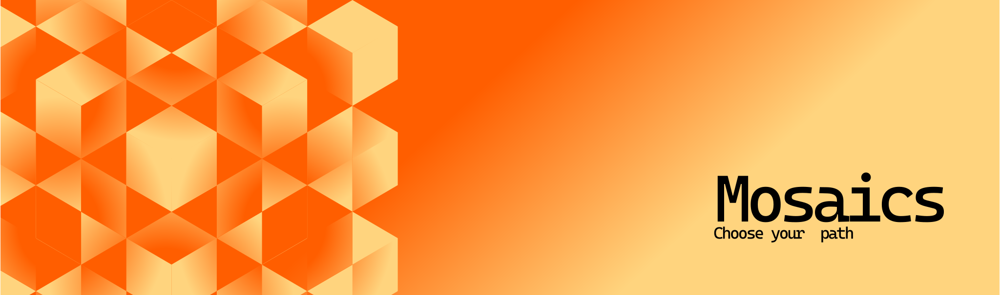
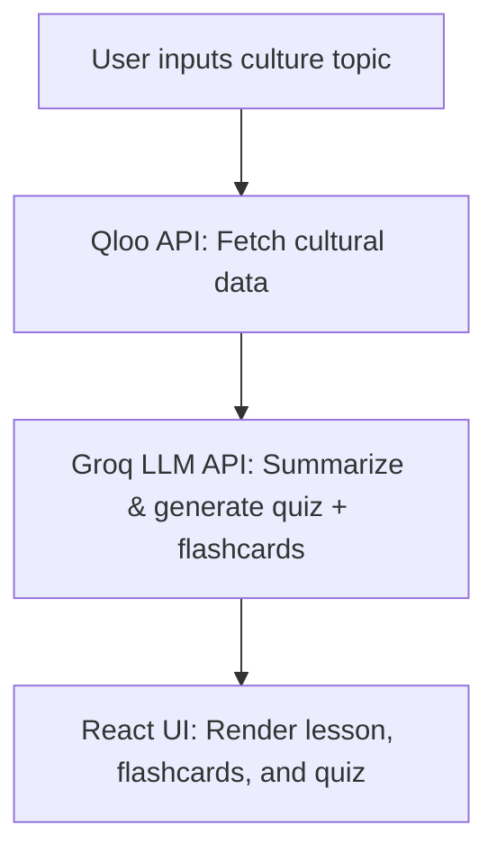

<div>
  <center> 
  
</center>
</div>

# **Essence – Cultural Learning App**
  [](https://react.dev)  [](https://vitejs.dev)  


---

## **Overview**
**Essence** is a Duolingo-inspired app for **cultural learning**.  
Instead of teaching languages, it helps users explore **traditions, rituals, food, and music** from around the world — through **AI-powered micro-lessons**.

- **Type a culture/topic** → AI curates content from Qloo API  
- **Summarized by Groq LLM** → Generates flashcards + quizzes  
- **Gamified UI** → Flashcards, quizzes, and lesson streaks (coming soon)

---
##  WHAT IS A MOSAIC 



- Each course in essence is called a mosaic  (like how mosaic artwork is formed from different pieces,  essence can let users learn and piece together different cultures and artforms )
- Mosaics can be created by signing in to the website 
- Each mosaic contains a study guide and then a quiz part

---
## **Features**

<center>
  
</center>

- 🔍 **Search Any Culture** – Enter any cultural tradition (e.g., *Japanese Tea Ceremony*).  
- 🧠 **AI Lessons** – Groq LLM summarizes info into short lessons by getting the recomendation from the qloo taste api for enhancing the learning experience.  
- 🃏 **Flashcards** – Flip cards to memorize cultural terms and meanings.  
- ❓ **Quizzes** – Quick multiple-choice quizzes for recall.  

---

## **Tech Stack**

- **Frontend:** React (Vite) + Hooks  
- **Styling:** Tailwind CSS (or basic CSS)  
- **APIs:**  
  - [Qloo  API](https://qloo.com/) – Cultural data 
  - [Groq LLM](https://groq.com/) – Summarization and quiz generation  
---

## **Architecture Diagram**




Setup & Installation
1. Clone the repository

```bash
git clone https://github.com/<your-username>/essence.git
cd essence
```
3. Install dependencies

```bash
npm install
```
4. Configure Environment Variables
Create .env file based on .env.example:
```ini
VITE_QLOO_API_KEY=your_qloo_api_key
VITE_GROQ_API_KEY=your_groq_api_key
VITE_PEXELS_API_KEY=your_pexels_api_key
```
4. Run the development server
```bash
npm run dev
```

# How It Works
- User Input: Type a culture (e.g., “Japanese Tea Ceremony”).
- API Flow: 
  - Fetch cultural data from Qloo API and fetches some key data that can enhance the llm learning experience
  - the groq llm gets it and then creates a mosaic (i.e course)
  - Summarize + create flashcards/quiz via Groq LLM
  - UI Render: Display lesson, flashcards, and quiz interactively.


